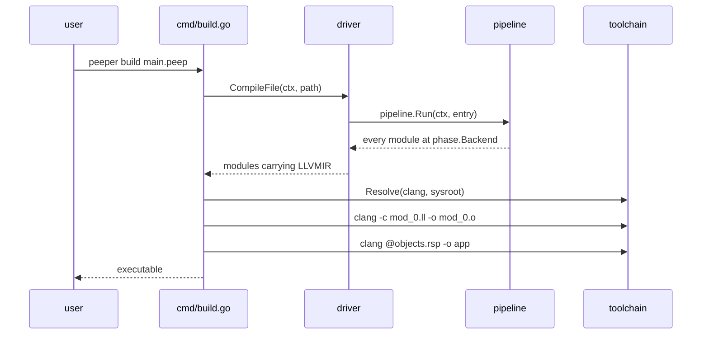
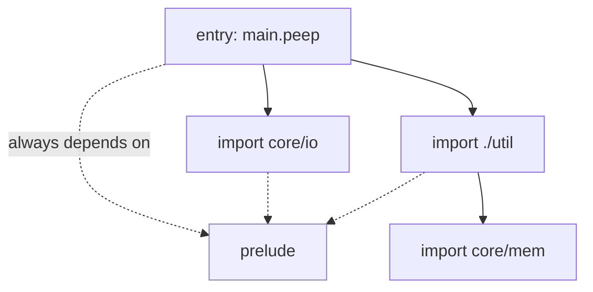
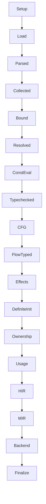
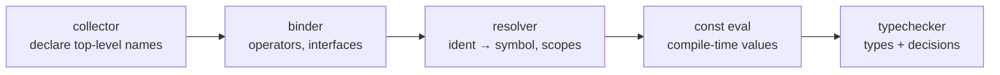
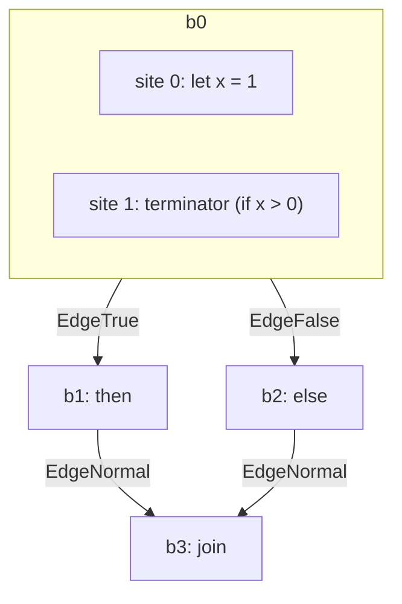
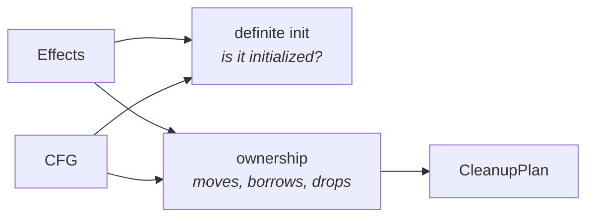
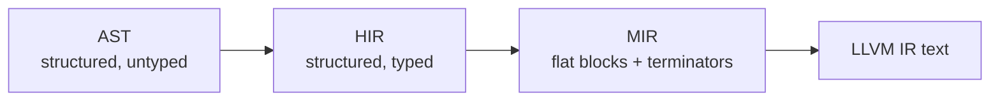

# Code tour: from `.peep` to an executable

A guided walk through the Peeper compiler, following one source file all the way to a
native binary. Read it top to bottom the first time; after that, jump to the phase you
need.

Every code sample here is **simplified** — real signatures carry more parameters and more
error handling. Each one names the file it came from so you can read the real thing.

Related reading: [`RULES.md`](RULES.md) for mandatory engineering requirements, [`COMPILER_GUIDELINES.md`](COMPILER_GUIDELINES.md) for design-review guidance, [`docs/compiler-architecture.md`](docs/compiler-architecture.md) for current architecture, and [`docs/compiler-framework/change-paths.md`](docs/compiler-framework/change-paths.md) for a file-by-file change guide. Verify mutable details against source.

---

## 1. The thirty-second version

```mermaid
flowchart LR
    SRC[".peep source"] --> LEX[lexer]
    LEX --> PAR[parser]
    PAR --> AST[AST]
    AST --> SEM[semantic analysis]
    SEM --> CFG[control-flow graph]
    CFG --> ANA[flow · effects · ownership]
    ANA --> HIR[HIR]
    HIR --> MIR[MIR]
    MIR --> LL["LLVM IR text"]
    LL --> CLANG["clang"]
    CLANG --> OBJ["object files"]
    OBJ --> LINK["linker"]
    LINK --> EXE["executable"]
```



The compiler itself stops at **LLVM IR text**. Turning that into a binary is `clang`,
invoked as an external tool. Peeper does not link anything by hand.

---

## 2. Package map

| Package | What lives there |
| --- | --- |
| `cmd/` | CLI commands: `build`, `run`, `check`, `dump`, `doctor` |
| `internal/driver` | Thin wrapper that builds a `CompilerContext` and compiles one file |
| `internal/pipeline` | Module loading and the phase ladder that drives everything |
| `internal/project` | `Module`, `CompilerContext` — where every phase artifact is stored |
| `internal/frontend` | `token`, `lexer`, `parser`, `ast` |
| `internal/semantics` | Collector, binder, resolver, const eval, typechecker, effects, definite init, ownership, usage, plus the artifact packages |
| `internal/ir` | `cfg`, `hir`, `mir`, and the shared `ir` node/type model |
| `internal/backend/llvm` | MIR → LLVM IR text |
| `internal/toolchain` | Finds `clang` and the sysroot; builds its command lines |
| `internal/diagnostics` | Errors, warnings, source rendering, phase attribution |
| `runtime/` | `peeper_rt.c` — the C runtime linked into every binary |
| `_builtin_library/core` | The `core` standard library, written in Peeper |

---

## 3. Entry: command → driver → pipeline



`driver.CompileFile` is deliberately small — it exists so the CLI, the LSP and the tests
all enter the compiler the same way.

---

## 4. Module loading

Before any phase runs, the loader walks imports and builds a dependency graph.

```go
// internal/pipeline/loader.go (simplified)
func (l *moduleLoader) Load(entry *project.Module) error {
    l.enqueue(entry)
    for len(l.queue) > 0 {
        module := l.pop()
        l.loadModule(module)      // read the file, lex, parse
        l.resolveImports(module)  // each import becomes a graph edge + a queued module
    }
    return nil
}
```

Modules are identified by `moduleid.ID` — origin, namespace, dependency and import path —
never by file path, so a module keeps its identity if the project moves on disk.

The dependency graph is the shared `internal/graph` package. `pipeline.Run` topologically
sorts it so a module is only advanced once everything it imports has reached the phase it
needs.



Every module is given an edge to the **prelude**, which is how the prelude is guaranteed
to be first in topological order without any special case in the scheduler.

---

## 5. The phase ladder

This is the spine of the compiler. Each module carries a `Phase`, and
`advanceModulePhase` moves it forward **exactly one step per call**.



```go
// internal/pipeline/pipeline.go (heavily simplified)
func advanceModulePhase(ctx *project.CompilerContext, module *project.Module) bool {
    if module.Phase < phase.Collected { collector.Collect(ctx, module); module.Phase = phase.Collected; return true }
    if module.Phase < phase.Bound     { binder.Bind(ctx, module);       module.Phase = phase.Bound;     return true }
    if module.Phase < phase.Resolved  { resolver.Resolve(ctx, module);  module.Phase = phase.Resolved;  return true }
    // ... one block per phase, in order ...
}
```

Why one phase per call? Because modules advance **in lockstep across the whole project**.
A module cannot be typechecked until every module it imports is typechecked, and the
scheduler enforces that by advancing everyone one rung at a time.

### What each phase produces

| Phase | Produces | Stored on `Module` as |
| --- | --- | --- |
| `Parsed` | syntax tree | `AST` |
| `Collected` | top-level symbols, method sets | `Bindings`, `ModuleScope` |
| `Bound` | operator/interface bindings | `Bindings` |
| `Resolved` | every identifier → symbol | `Bindings` occurrence index |
| `ConstEval` | compile-time constants | `Constants` |
| `Typechecked` | types and typing decisions | `Typechecking`, `TypedASTNodes` |
| `CFG` | blocks, sites, edges | `CFG` |
| `FlowTyped` | per-use narrowing | `Flow` |
| `Effects` | ordered semantic effects | `Effects` |
| `DefiniteInit` | *diagnostics only* | — |
| `Ownership` | drop plan | `Ownership` |
| `Usage` | *warnings only* | — |
| `HIR` | typed high-level IR | `HIR` |
| `MIR` | flat, block-structured IR | `MIR` |
| `Backend` | LLVM IR text | `LLVMIR` |

**Phase artifacts are the central design idea.** Each fact is produced by exactly one
phase, stored in exactly one place, and read by later phases. No phase reaches backwards
to recompute something an earlier one already decided.

`Module.resetToPhase` clears artifacts in phase order, so incremental rebuilds cannot
leave stale evidence behind:

```go
// internal/project/modules.go (simplified)
func (m *Module) resetToPhase(retained phase.Phase) {
    if retained < phase.Typechecked { m.Typechecking = nil; m.TypedASTNodes = nil }
    if retained < phase.CFG         { m.CFG = nil }
    if retained < phase.Effects     { m.Effects = nil }
    if retained < phase.Ownership   { m.Ownership = nil }
    // ...
}
```

---

## 6. Front end: text → AST

```go
// internal/frontend — the whole front end, in three lines
tokens := lexer.New(path, source, diag).Tokenize()
module := parser.New(path, tokens, diag).ParseModule()
```

The parser is recursive descent and **error-recovering**: on a syntax error it emits a
diagnostic and produces a `BadStmt` / `BadExpr` node rather than bailing out. Later phases
treat recovery nodes as inert, which is why the LSP can still offer completion in a file
that does not parse cleanly.

AST nodes carry:

- a **`NodeID`** — stable identity used as the key for every later fact about that node;
- a **`Location`** — for diagnostics;
- `forEachChild` — the one canonical child walk.

```go
// internal/frontend/ast (simplified)
type ForStmt struct {
    Index, Value *Ident
    Iterable     Expr
    Cond         Expr
    Body         *BlockStmt
}

func (s *ForStmt) forEachChild(visit func(Node)) {
    visit(s.Index); visit(s.Value); visit(s.Iterable); visit(s.Cond); visit(s.Body)
}
```

Forgetting a field in `forEachChild` makes it invisible to `ast.Inspect`, so traversal behavior is covered by ordinary AST tests and source fixtures rather than a second parser for the compiler implementation.

---

## 7. Semantic analysis



**Collector** walks top-level declarations and puts them in `ModuleScope`. **Binder**
resolves declaration types, publishes method sets, and wires up operator/interface members.
**Resolver** creates block scopes and maps every referencing identifier to its symbol:

```go
// internal/semantics/resolver (simplified)
module.Bindings.Bind(ident, symbol)
module.Bindings.SetScope(block, scope)
```

> **Identity rule.** `Bindings` records resolved syntax occurrences, including
> declaration names and assignment targets. Lexical scopes remain responsible for name
> lookup, shadowing, visibility, and declaration order; downstream phases use the
> published node identity instead of rescanning symbols by AST pointer.

**The typechecker** does more than check types — it *publishes decisions* later phases
depend on, so nothing has to re-derive them:

```go
// internal/semantics/typecheckresult/result.go (excerpt)
result.RecordExprType(expr.ID(), typ)
result.RecordImplicitConversion(expr.ID(), conversion)
result.RecordForIteration(loop.ID(), iteration)

// Later phases ask semantic questions; the backing indexes stay private.
typ := result.ExprType(expr.ID())
conversion, ok := result.ImplicitConversion(expr.ID())
iteration, ok := result.ForIteration(loop.ID())
```

---

## 8. Control-flow graph

CFG turns structured syntax into blocks, **sites** and typed edges.



A **site** is one ordered program point inside a block:

```go
// internal/ir/cfg/model.go (simplified)
type SiteID struct{ Block, Index int }   // dense and positional

type Site struct {
    ID       SiteID
    Kind     SiteKind          // statement | scope exit | terminator | join
    NodeID   ir.NodeID         // the AST node this point stands for
    ScopeID  ir.NodeID
    Successors, Predecessors []Edge
}
```

Edges keep their meaning — `EdgeTrue`, `EdgeFalse`, `EdgeVariantCase` with a case index —
so consumers never guess control flow from adjacency order.

CFG does not import the typechecker. It asks for the two facts it needs through narrow
function types, which the typechecker result happens to satisfy:

```go
// internal/ir/cfg/build.go
type BuildQueries struct {
    MatchCases          func(ast.NodeID) ([]int, bool)
    LoopGuaranteedEntry func(ast.NodeID) bool
}
```

`cfg.Module.Validate()` then checks the topology it produced — block identity, termination,
adjacency in both directions, reachability — and raises an internal-compiler-error
diagnostic rather than a user-facing one, because malformed topology is a compiler bug.

---

## 9. Effects: the semantic operation stream

This is the newest layer, and the one that makes later analyses construct-agnostic.

**The problem it solves:** definite initialization and ownership each used to walk the AST
themselves, re-deriving what every construct did to a binding. Two walks that had to agree
— and sometimes did not.

One producer now translates each CFG site into ordered operations:

```go
// internal/semantics/effect/model.go (simplified)
type Op interface{ effectOp() }   // sealed set

type Place struct {
    Root        *symbols.Symbol           // the binding …
    Temporary   ast.NodeID                // … or the expression, for a value owning nothing
    Projections []place.OriginProjection  // .field, [index]
}

type Define  struct{ Symbol *symbols.Symbol; Initialized, OnEntry bool }
type Write   struct{ Place Place }
type Use     struct{ Place Place; Kind typeinfo.UseKind }
type Borrow  struct{ Place Place; Mutable, Argument, Raw bool }
type Discard struct{ Place Place }
type CallBegin struct{ Node ast.NodeID }
type CallEnd   struct{ Node ast.NodeID }
```

The producer is the only code that reads syntax to decide meaning:

```go
// internal/semantics/effect/build.go (simplified)
func (b *builder) value(site cfg.SiteID, expr ast.Expr, kind typeinfo.UseKind) {
    switch node := expr.(type) {
    case *ast.Ident:
        if sym := b.queries.Symbols[node.ID()]; sym != nil {
            b.emit(site, Use{Place: Place{Root: sym}, Kind: kind})
        }
    case *ast.BinaryExpr:
        if b.queries.StringConcatenation(node.ID()) {    // decided by the typechecker
            b.value(site, node.Left, typeinfo.UseMove)   // concat consumes its left
            b.value(site, node.Right, typeinfo.UseRead)
            return
        }
        b.value(site, node.Left, typeinfo.UseRead)
        b.value(site, node.Right, typeinfo.UseRead)
    case *ast.CallExpr:
        b.emit(site, CallBegin{Node: node.ID()})
        b.value(site, node.Callee, typeinfo.UseRead)
        for _, arg := range b.queries.CallArguments(node) {
            b.argument(site, arg)                        // borrows if the parameter is a reference
        }
        b.emit(site, CallEnd{Node: node.ID()})
    // … one case per expression kind, then: default: panic(…)
    }
}
```

Three subtleties that are easy to get wrong, all learned the hard way:

- **`Define.OnEntry`** — a parameter, or a match payload binding, exists *before* its site
  runs. It is created by the edge into the site, not by the site. Liveness must not treat
  that as a definition within the site or it ends a borrow one step early.
- **`CallBegin`/`CallEnd`** — a call is a *lifetime*, not a position. A temporary created
  while computing an argument lives until the call completes. A flat list of uses has
  nowhere to hang that.
- **`Place.Temporary`** — `f().field` projects out of a value that lives in no binding.
  Ownership treats that differently, so the vocabulary has to be able to say it.

---

## 10. The analyses that consume it



They currently share **evidence, not solver machinery**. Each has distinct lattice, join direction, and diagnostics. A shared solver would need to reduce real duplication without hiding those differences.

**Definite initialization** is a must-analysis: a symbol is initialized only if it is
initialized on *every* path, so the join is intersection.

```go
// internal/semantics/definiteinit (simplified)
func apply(current state, op effect.Op) {
    switch op := op.(type) {
    case effect.Define:  if op.Initialized { current[op.Symbol.ID] = struct{}{} }
    case effect.Write:   current[op.Place.Root.ID] = struct{}{}
    case effect.Use:     // a read changes nothing
    case effect.Borrow:  // nor does taking a reference
    default:             panic("unhandled effect")   // a new op fails loudly here
    }
}
```

It contains **no AST switch at all** and does not import `ast` beyond `NodeID`.

**Ownership** tracks moves, loans and liveness, then writes the drop plan:

```go
// internal/semantics/ownership/effects.go (simplified)
for _, op := range a.effects[site.ID] {
    switch op := op.(type) {
    case effect.CallBegin:
        calls = append(calls, callFrame{                 // remember where this call's loans start
            call: callFor(op), temporary: len(loans.temporary), reserved: len(loans.reserved),
        })
    case effect.CallEnd:
        frame := pop(&calls)
        a.activateCallReservations(frame.call, frame.reserved, loans)  // fire at call start
        loans.temporary = loans.temporary[:frame.temporary]            // argument temporaries die
        loans.reserved = loans.reserved[:frame.reserved]
    case effect.Use:
        a.applyUse(op, st, loans)                        // move state + storage access
    case effect.Borrow:
        a.applyBorrow(op, st, loans, calls)              // access + loan
    }
}
```

The result is the `CleanupPlan` — the **single source of drop obligations** over source
values:

```go
// internal/semantics/ownershipresult/result.go
type CleanupPlan struct {
    AfterScope     map[cfg.SiteID][]symbols.SymbolID  // scope exit
    BeforeReturn   map[ir.NodeID][]symbols.SymbolID   // after the value is computed
    BeforeAssign   map[ir.NodeID]struct{}             // replacing a value drops the old
    DiscardedValue map[ir.NodeID]struct{}             // a temporary nobody owns
    // …
}
```

Lowering *reads* this plan. It never decides a drop for itself.

---

## 11. Lowering: HIR → MIR

**HIR** is typed and still structured — `If`, `For`, `Block` are real nodes. It consumes
published evidence rather than re-deciding anything:

```go
// internal/ir/hir/lower (simplified)
conversion, converting := module.Typechecking.ImplicitConversion(expr.ID())
iteration, found := module.Typechecking.ForIteration(stmt.ID()) // carrier, cursor, bounds
```

**MIR** is flat: basic blocks, instructions, terminators — close to what a backend wants.

```go
// internal/ir/mir/model.go (simplified)
type Instr interface{ instrNode() }       // Assign Store Print Drop DynamicArrayOp Call InterfaceCall
type Terminator interface{ termNode() }   // Jump Branch SwitchVariant Ret
```

Both sets are **sealed** by unexported marker methods, so an instruction can never be used
where a terminator belongs. MIR lowering walks CFG sites and consumes the cleanup plan to
place drops.



---

## 12. Backend and linking

```go
// internal/backend/llvm/emitter.go (simplified)
func GenerateLLVMIR(mod *mir.Module, …) string {
    for _, fn := range mod.Funcs {
        for _, block := range fn.Blocks {
            for _, instr := range block.Instrs {
                switch typed := instr.(type) {
                case *mir.Assign: emitValue(lb, typed.Value)
                case *mir.Drop:   emitDrop(lb, typed)
                // …
                }
            }
            switch term := block.Term.(type) {
            case *mir.Jump:   lb.branch(target)
            case *mir.Branch: lb.condBranch(cond, then, els)
            case *mir.Ret:    lb.ret(value)
            }
        }
    }
    return b.String()
}
```

The emitter produces **LLVM IR text**, not bitcode. Then `cmd/build.go` shells out:

```go
// cmd/build.go (simplified)
for i, module := range modules {
    os.WriteFile(fmt.Sprintf("mod_%d.ll", i), []byte(module.LLVMIR), 0o644)
    runCompilerTool(profile.ClangPath, profile.ObjectArgs(llPath, objectPath, debug))
}
profile.WriteResponseFile(responsePath, objectPaths)
runCompilerTool(profile.LinkerPath, profile.LinkArgs(responsePath, stagedPath))
```

`internal/toolchain` finds a *managed* clang and sysroot if one is installed, and falls
back to `clang` on `PATH` with a warning. The C runtime in `runtime/peeper_rt.c` is linked
in to provide allocation and printing.

Object files go through a **response file** rather than a long command line, which keeps
the link working on platforms with tight argument limits.

---

## 13. Guardrails

The compiler is built so that *forgetting* something fails loudly.

| Guard | Where | Catches |
| --- | --- | --- |
| AST traversal tests | `frontend/ast` tests + source fixtures | broken child traversal behavior |
| Sealed semantic type contract | Go type system | missing child/ownership behavior on a new semantic type |
| HIR validation + required node methods | `internal/ir/hir` | malformed or incomplete HIR nodes |
| MIR/backend rejecting dispatch | `internal/ir/mir`, `backend/llvm` | unsupported lowered nodes fail loudly |
| `cfg.Validate` | `internal/ir/cfg` | malformed topology |
| `effect.Validate` | `internal/semantics/effect` | operations with no symbol, unbalanced calls |
| `ownershipresult.Validate` | `internal/semantics/ownershipresult` | evidence that contradicts published types |

A contract failure reads like this:

```
publishStmt makes no decision about ast.YieldStmt; add a case or declare why the kind is inert
```

At true closed extension points, every omission must be handled or deliberately
classified. Generic downstream analyses should not grow AST classifications at all;
they consume canonical CFG/type/place/effect evidence instead.

---

## 14. Adding a language feature

For a new syntax construct, in order:

1. **token** — a keyword or token kind, if the syntax needs one.
2. **AST node** — the struct, its family marker, and `forEachChild`.
3. **parser** — build the node, with recovery.
4. **resolver** — scopes and bindings.
5. **typechecker** — the type rule, and *publish* whatever later phases will need.
6. **CFG** — only if the control-flow shape is genuinely new.
7. **effects** — one case in `publishStmt`/`value` saying what it does to bindings.
8. **HIR/MIR** — only if no existing lowering shape can represent it.

Steps 1–6 are unavoidable: where a name lives and what types are legal *is* the feature.
Step 7 is what buys you definite initialization, ownership, liveness, drops and usage
**for free** — they consume operations and never learn your construct exists.

`docs/compiler-architecture.md` defines why these boundaries exist;
`docs/compiler-framework/change-paths.md` gives the concrete edit path and the guard
at each true extension point.

---

## 15. Glossary

| Term | Meaning |
| --- | --- |
| **NodeID** | Stable identity of one AST node; the key for every fact about it |
| **SymbolID** | Stable identity of one declaration |
| **SiteID** | `{Block, Index}` — one ordered program point in a CFG |
| **Place** | Storage: a root binding (or a temporary) plus projections |
| **Artifact** | A phase's published output, owned by exactly one phase |
| **Prelude** | Implicitly imported module every other module depends on |
| **Contract** | A test that forces an explicit decision for every node kind |
| **Validator** | A boundary check on an artifact's shape, reported as a compiler bug |

---

## 16. Where to look when

| Question | Start here |
| --- | --- |
| Why is my program rejected? | `internal/diagnostics/codes.go`, then the phase that owns the code |
| How does phase ordering work? | `internal/pipeline/pipeline.go`, `advanceModulePhase` |
| What does the typechecker publish? | `internal/semantics/typecheckresult/result.go` |
| Why is a value moved/dropped here? | `internal/semantics/effect`, then `internal/semantics/ownership` |
| What does the backend emit for X? | `internal/backend/llvm/emitter.go` |
| How do I add a node kind safely? | `docs/compiler-architecture.md`, then the owning syntax boundary |
