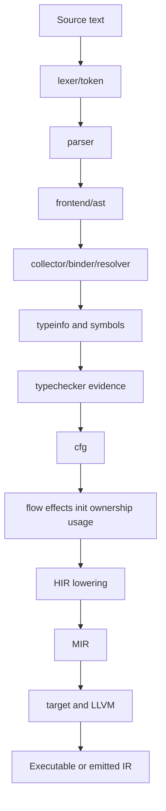

# Compiler architecture maps

These maps record implementation observed in source: where code lives, what each package currently does, and how data moves between files and stages. Verify mutable details against linked symbols. Maps do not prescribe future package boundaries, phase order, or ownership.

See [`../compiler-architecture.md`](../compiler-architecture.md) for current overview, [`../../RULEBOOK.md`](../../RULEBOOK.md) for design-review questions, and [`../../RULES.md`](../../RULES.md) for durable engineering requirements.

## Maps

| Map | Covers |
|---|---|
| [Frontend](frontend.md) | Lexer, tokens, parser, AST, source locations, node identity, traversal, cloning |
| [Semantics: bindings](semantics-bindings.md) | Collection, binding, resolution, symbols, scopes, types, places, constants, semantic result models |
| [Semantics: analyses](semantics-analyses.md) | Typechecking, flow typing, CFG-driven effects, definite initialization, ownership, cleanup, usage |
| [IR](ir.md) | Core IR types, CFG, HIR, HIR lowering/folding, MIR |
| [Backend](backend.md) | Target descriptions, physical layouts, ABI decisions, LLVM emission |
| [Infrastructure](infrastructure.md) | Modules, pipeline scheduling, project state, diagnostics, graphs, source, toolchains |
| [LSP](lsp.md) | Server state, document snapshots, incremental compilation, requests, diagnostics, symbols |
| [CLI and packages](cli-and-packages.md) | CLI registry and commands, packaging, manifests, registries, scripts, fixtures, support packages |

## End-to-end data flow

Current compilation is scheduled by `internal/pipeline` and operates on module snapshots in `internal/project`. Stages publish artifacts or evidence consumed by later work.



## Identity map

| Identity | Created by | Used for |
|---|---|---|
| `ast.NodeID` | parser or AST synthetic-node allocator | Source and generated AST lookup, semantic evidence maps |
| `symbols.SymbolID` | symbol creation | Binding, ownership roots, cleanup plans, semantic references |
| module ID | `internal/moduleid` | Cross-module identity, imports, caches, invalidation |
| `cfg.SiteID` | CFG construction | Per-statement and terminator analysis sites |
| `ir.NodeID` | derived from source AST identity | IR statement, block, and expression provenance |
| `ir.TypeID` | shared IR type interning | Runtime type identity consumed by HIR, MIR, and backend layout |

Identity changes require checking every producer and consumer. Source AST identity and generated identity currently have different tooling and semantic requirements; see frontend and semantics maps for observed behavior.

## Folder map

```text
docs/
├── compiler-architecture.md       pipeline and architectural invariants
├── language-spec.md               source-language behavior
├── ownership-pointer-model.md     ownership and pointer model
├── compiler-framework/            focused framework design notes
├── diagrams/                      D2 architecture diagrams
└── architecture/                  package and data-flow maps
    ├── frontend.md
    ├── semantics-bindings.md
    ├── semantics-analyses.md
    ├── ir.md
    ├── backend.md
    ├── infrastructure.md
    ├── lsp.md
    └── cli-and-packages.md
```

## How to use these maps

### Adding a language feature

1. Start with [`language-spec.md`](../language-spec.md) and identify source behavior.
2. Find syntax ownership in [Frontend](frontend.md).
3. Find binding/type ownership in [Semantics: bindings](semantics-bindings.md).
4. Find the semantic evidence and analysis consumers in [Semantics: analyses](semantics-analyses.md).
5. Verify CFG, HIR, MIR, and backend lowerability in [IR](ir.md) and [Backend](backend.md).
6. Add positive and negative `x_test/` fixtures plus focused phase tests.
7. Update the affected map when ownership or data flow changes.

### Debugging a wrong result

| Symptom | Start here |
|---|---|
| Wrong parse or recovery | [Frontend](frontend.md) |
| Name/type not found | [Semantics: bindings](semantics-bindings.md) |
| Wrong type refinement | [Semantics: analyses](semantics-analyses.md), typechecker flow section |
| Missing cleanup or move error | [Semantics: analyses](semantics-analyses.md), ownership/effect sections |
| Wrong control flow | [IR](ir.md), CFG section |
| Wrong HIR/MIR shape | [IR](ir.md), lowering sections |
| Invalid layout or emitted LLVM | [Backend](backend.md) |
| Stale diagnostics or hover | [LSP](lsp.md) and [Infrastructure](infrastructure.md) |
| CLI, package, or fixture failure | [CLI and packages](cli-and-packages.md) |

### Updating a map

Keep entries factual and symbol-based:

- name the owning package and file;
- state concrete inputs and outputs;
- explain identity keys and phase boundaries;
- describe non-obvious invariants, not obvious syntax;
- avoid copying the whole implementation or duplicating the language specification;
- update data-flow prose when a handoff changes.
