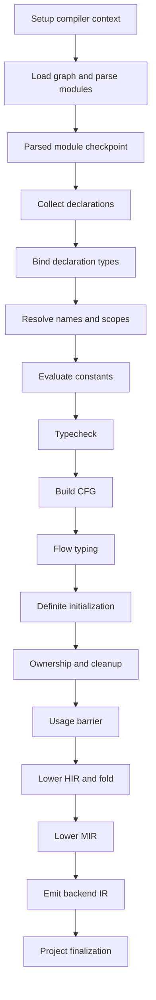

# Compiler Framework

This document defines planned framework work for making Peeper compiler changes
mechanical, auditable, and hard to complete incorrectly. Goal is not generic
compiler infrastructure. Goal is explicit contracts around Peeper's real phases so
adding syntax, semantics, analyses, or backends immediately exposes every required
change point.

This is a roadmap. Sections marked **Current** describe code that exists on `main`.
Sections marked **Target** describe work still requiring implementation and review.
Mandatory policy remains in [`RULES.md`](../../RULES.md). Durable engineering
principles remain in [`COMPILER_GUIDELINES.md`](../../COMPILER_GUIDELINES.md).
This document applies those rules to concrete compiler subsystems; it does not
replace them.

## Objectives

Framework work must establish these guarantees:

1. Every phase has one named owner, explicit inputs, explicit output, documented
   invariants, diagnostics, consumers, and invalidation rules.
2. Adding a node or changing child structure cannot silently omit traversal.
3. Every semantic phase makes an explicit handle, traverse, ignore, or reject
   decision for every relevant node kind.
4. Invalid phase artifacts fail at their producing boundary, not in an unrelated
   downstream phase or backend.
5. Later phases consume established semantic evidence instead of rediscovering it.
6. Control-flow consumers use canonical CFG topology and typed edges/sites instead
   of inferring meaning from incidental block shape. Construct metadata is added
   only when inspected consumers prove a missing shared invariant.
7. Naming, mangling, generated artifacts, and backend ABI naming each have one
   purposeful owner.
8. Contributor tests fail when a required phase decision is missing.

A fork should be able to replace syntax, selected semantic rules, runtime policy,
or backend details while retaining these safety contracts. Copyability is a useful
design pressure, not promise of a language-generator product.

## Non-goals

Framework work must not introduce:

- generic pass manager hiding current scheduler or phase dependencies;
- compiler-wide artifact builder mixing AST, HIR, MIR, and backend policy;
- default visitor methods that silently ignore new node kinds;
- pass-through wrappers around existing canonical functions;
- duplicate result maps kept during migration;
- validators that repeat semantic analysis;
- source-shape rediscovery in HIR, MIR, ownership, or backend lowering;
- fake HIR, MIR, or backend artifacts created only for tests or examples;
- stable extension APIs before real independent consumers exist.

A boundary earns its place only when it owns a phase result, lifetime, invariant,
policy, or independently reused operation.

## Current framework kernel

### Pipeline

**Current.** Phase identity lives in `internal/phase/phase.go`. Project orchestration
lives in `internal/pipeline/pipeline.go`.

Canonical orchestration points:

| Responsibility | Current owner |
| --- | --- |
| Run one project | `pipeline.Run` |
| Schedule ready modules | `advanceModulesThrough` |
| Choose next phase | `nextModulePhase` |
| Check import prerequisites | `moduleReadyForNextPhase` and `importPrerequisitePhase` |
| Execute one module phase | `advanceModulePhase` |
| Detect scheduler stalls | `requireScheduledModulesAtLeast` |
| Invalidate semantic dependents | `invalidateSemanticDependents` |
| Store one source unit and retained artifacts | `project.Module` |
| Store shared compilation state | `project.CompilerContext` |

`Setup`, `Load`, and `Finalize` are project checkpoints. `Parsed` through `Backend`
are retained per-module checkpoints. `Usage` is a project barrier after all
scheduled modules reach ownership. Framework work must preserve distinction
between per-module transitions, dependency readiness, and project barriers. Do not
add a uniform `Pass.Run` abstraction that hides these differences.

### Retained artifacts

**Current.** `project.Module` retains artifacts across incremental compilation and
`resetToPhase` defines their lifetimes.

| Artifact | Current field or owner | Producer | Main consumers |
| --- | --- | --- | --- |
| Parsed syntax | `Module.AST` | parser | semantic phases, CFG, HIR |
| Module symbols | `Module.ModuleScope` | collector and binder | resolver onward |
| Staged binding graph | `Module.Bindings` / `bindingresult.Result` | collector through typechecker | CFG, flow, ownership, HIR, LSP |
| Constant evaluation | `Module.Constants` / `constantresult.Result` | const evaluation and later constant queries | fingerprinting, CFG, flow, HIR, MIR |
| Base typechecker evidence | `Module.Typechecking` / `typecheckresult.Result` | base typechecker | CFG, consteval, flow, definite-init, ownership, HIR |
| Typed AST index | `Module.TypedASTNodes` | pipeline after typecheck | CFG-sensitive phases |
| Control-flow graph | `Module.CFG` | CFG builder | flow, definite-init, ownership, MIR |
| Flow evidence | `Module.Flow` / `flowresult.Result` | flow typechecker | ownership, HIR, tooling |
| Ownership evidence | `Module.Ownership` / `ownershipresult.Result` | ownership | MIR |
| High-level IR | `Module.HIR` | HIR lowering plus typed expression folding | MIR, dumps/tooling |
| Mid-level IR | `Module.MIR` | MIR lowering | backend |
| Backend text | `Module.LLVMIR` | LLVM backend | build/link and dumps |

`project.Module` is a source-unit aggregate. It is not itself a phase result.
Framework work should split mixed result ownership where useful without wrapping the
aggregate or forcing every artifact into a generic result interface.

### Module identity

**Current.** `moduleid.ID` is the one canonical module identity. It is a comparable
value of `Origin`, `Namespace`, `Dependency`, and `ImportPath`, and it is the key for
`ctx.modules`, `ctx.fileIndex`, `ctx.semanticExportBaselines`, import resolution,
`symbols.Symbol.DefiningModule`, and type-declaration identity.

Identity is logical, not positional: it survives filesystem relocation, and file path
is a secondary index only. Path-based `Module.Key`, `symbols.DefiningModuleKey`,
`ModuleKeyFor`, `ModuleByKey`, and loader-side identity backfill no longer exist.

`ID.Valid()` is the single identity predicate and requires both `Origin` and
`ImportPath`. That is what keeps map keys distinct: an identity carrying only an
origin would collapse every local module onto one entry. Do not add an `IsZero()`
counterpart; a partially populated identity is invalid, not empty.

String-only boundaries take `ID.String()`, which length-frames each component in hex
so no delimiter collision is possible. Graph node IDs and diagnostics module scoping
are such boundaries and consume the encoding rather than the struct. `internal/diagnostics`
still names these parameters `moduleKey`; it is deliberately identity-agnostic and
that rename is outstanding terminology debt.

Module construction derives identity once, in `CompilerContext.NewModuleForFile` or
`prelude.ModuleID(ctx)`. `NewModuleForFile` returns nil when no import path can be
derived, so callers must establish project root containment first; `cmd/build.go`
and both LSP entry paths do this through `manifest.ResolveSourceFileProject` and
`manifest.PathWithinSourceDir`, and report a source-root diagnostic rather than an
identity failure.

Every identity must be derivable from the file it names. `prelude.ModuleID` resolves
the prelude path and runs it back through `ImportPathForFile`, so the auto-loaded
prelude registers under exactly the identity `ResolveImportPath` produces for an
explicit `core:global` import. A hardcoded import path here registers the file under
an identity no import can reproduce, and the same file then arrives twice under two
identities.

`AddModule` enforces one identity per file. That conflict is reachable from user
source and from library-root configuration, so it emits an `ErrAmbiguousImport`
diagnostic and keeps the first registration rather than panicking; identity
conflicts are user-facing errors, not impossible states.

### Structural traversal

**Current.** Reuse these APIs:

| Representation | Canonical traversal |
| --- | --- |
| AST declarations | `ast.ForEachDecl` |
| AST nodes | `ast.Inspect` with node-owned `forEachChild` |
| HIR statements | `hir.InspectStmt` with statement-owned `forEachChild` |
| Shared expressions | `ir.InspectExpr` |
| Places and projection expressions | `ir.InspectPlace` |

These APIs solve structural recursion. They do not solve exhaustive semantic
handling. A resolver or typechecker still needs a phase-specific decision for each
node kind because handling behavior differs by phase.

MIR and CFG currently use explicit graph/block/instruction loops. Add canonical
walkers only after concrete consumers need identical traversal semantics.

### Existing phase-owned results

**Current.** Five semantic results have purposeful packages or direct owners:

- `bindingresult.Result` owns block scopes, node-to-symbol bindings, method receiver/declaration indexes, and operation-function catalog over one staged symbol graph. Collector initializes it; collector, binder, resolver, and typechecker complete it; reset to `Parsed` discards it.
- `constantresult.Result` physically separates authoritative post-typecheck `ModuleValues` from mutable pretypecheck/local `QueryCache` entries. `FinalizeValues` republishes top-level constants without retaining duplicate cache entries; fingerprints and MIR consume only `ModuleValues`. Foreign constant queries resolve the defining module and read its published values without copying into consumer cache.
- `typecheckresult.Result` owns base expression types, effective call arguments, generated-default binding markers, implicit conversions, implicit call arguments, interface implementation slots, intrinsic dispatch, string concatenation classification, variant construction, base case tests, match evidence, and for-iteration evidence for one base-typecheck generation. It also owns `CaseTest`, match, and iteration evidence models. `typechecker.Check` publishes a fresh result; reset below `Typechecked` discards it.
- `flowresult.Result` owns flow-refined types, origins, payload access, flow-sensitive case tests, and variant-field evidence. Its case-test entries use the earlier `typecheckresult.CaseTest` model while remaining a distinct flow result map.
- `internal/semantics/ownershipresult` owns cleanup plans consumed by MIR.

`project.SemanticInfo` and mixed `Module.ConstValues` storage have been removed. All semantic evidence and constant-evaluation artifacts now have explicit owners and reset contracts.

### Existing validation

**Current.** Validation is mostly embedded in producing or consuming phases:

- parser and semantic phases emit source diagnostics;
- `cfg.Analyze` checks unreachable sites, constant non-loop conditions, and
  return completeness without mutating finalized topology;
- pipeline validates program entrypoint and scheduler completion;
- `llvm.ValidateRuntimeSymbols` validates reserved runtime symbols and extern
  ownership constraints;
- backend layout and typed emission helpers reject physical type mismatches.

No canonical structural verifier currently exists for complete CFG, HIR, or MIR
artifacts.

## Phase contract

**Target.** Every phase must publish or document this contract:

| Contract field | Required meaning |
| --- | --- |
| Owner | One package responsible for decision and output |
| Inputs | Exact artifacts and prerequisite guarantees consumed |
| Output | Explicit result, artifact mutation, or diagnostic-only effect |
| Invariants | Facts guaranteed when phase completes without internal error |
| Diagnostics | Codes, text, spans, ordering, deduplication, and source identity owned by phase |
| Consumers | Later phases allowed to depend on output |
| Invalidation | Earliest edit/checkpoint that discards output |
| Mutation and concurrency | State mutated, synchronization owner, and whether modules may run in parallel |
| Determinism | Output, diagnostics, fingerprints, and names that must not depend on scheduler order |
| Failure policy | User diagnostic, recoverable invalid artifact, or internal error |
| Verification | Focused tests and boundary validator proving contract |

A phase may mutate a purposeful artifact when identity continuity requires it, such
as binding collected symbol objects in place. Contract must state that mutation;
it must not be hidden behind generic `Run` methods.

### Proposed migration constraints

These constraints require confirmation from Workstream 1 inventory before becoming
code or repository policy:

1. Phase result models should contain inert phase data rather than orchestration.
2. Candidate dependency direction is from `project.Module` to result models, with
   result models avoiding imports of scheduler/orchestration state.
3. One fact needs one producer and one canonical storage location.
4. Each migrated field should move with all consumers in one reviewable step when
   feasible; if a larger migration cannot do that safely, approved plan must state
   temporary state and removal gate explicitly.
5. No compatibility map, stale alias, or forwarding accessor may remain after a
   migration step closes.
6. Existing flow and ownership results stay separate unless inspected ownership,
   lifetime, and consumer evidence supports another boundary.
7. Backend physical layout remains backend-owned and never mutates semantic order.

## Workstream 1: Separate phase-owned semantic results

**Complete.** Field inventory and approved ownership/lifetime decisions are tracked in [`semantic-results.md`](semantic-results.md). Base-typechecker evidence lives in `typecheckresult.Result`; staged collection/binding/resolution state lives in `bindingresult.Result`; authoritative constants and mutable evaluator cache live in separate maps inside `constantresult.Result`. Module bindings carry defining identity, and dependencies reach `Typechecked` before consumer constant evaluation so foreign reads are authoritative and race-free. `SemanticInfo`, mixed `Module.ConstValues`, compatibility maps, and forwarding accessors no longer exist.

For each field record:

- producing phase and exact write sites;
- consuming phases and exact read sites;
- key identity (`NodeID`, `SymbolID`, CFG site, or declaration identity);
- reset checkpoint;
- incremental fingerprint dependency;
- whether field is base semantics, flow semantics, lowering evidence, or shared
  symbol state.

Then migrate one real owner at a time. Likely boundaries include resolver result and
typechecker result, but package names and shapes must follow inventory rather than
this document's guess.

Acceptance criteria:

- every migrated field has one producer and one storage location;
- `ResetModule` and `resetToPhase` discard result at correct checkpoint;
- semantic export fingerprints remain stable or intentionally change with tests;
- diagnostic codes, text, primary/secondary spans, module/source identity,
  observable ordering, and deduplication remain unchanged unless an intentional
  change has focused regression coverage;
- shared state remains race-free under parallel module scheduling;
- repeated runs preserve applicable fingerprints, diagnostics, generated names,
  and HIR/MIR output;
- all call sites use new canonical result directly;
- no wrapper or duplicate compatibility map survives migration.

## Workstream 2: Exhaustive node-handling contracts

**Target.** Structural inspectors continue owning child traversal. Separate
phase-handling contracts make node-kind omissions visible.

First experiment covers all production `ast.Stmt` implementations and an inspected
set of phases that dispatch on statements. Exact phase list and canonical kind
registry must be recorded before implementation. If experiment works without
excess boilerplate, extend same contract separately to declarations, expressions,
and type syntax.

Each participating phase explicitly classifies each statement kind as:

- **handle**: phase owns distinct semantics for node;
- **traverse**: phase only needs canonical child walk;
- **ignore**: node is intentionally irrelevant, with reason;
- **reject**: node is invalid at this phase boundary.

Do not implement this with visitor base classes containing no-op defaults. Candidate
mechanisms must be evaluated against real AST statement family first:

1. compile-time visitor interfaces requiring every method;
2. mechanically checked dispatch tables keyed by declared node kind;
3. focused completeness tests comparing declared kinds to phase decisions.

Choose least boilerplate mechanism that makes omission fail compilation or normal
tests.

Acceptance criteria:

- adding one production-registered statement kind fails until every participating
  phase updates;
- completeness source is same registry or sealed dispatch mechanism used by
  production nodes, not test-only parallel list;
- adding child field fails traversal completeness test until `forEachChild` updates;
- recovery statements have explicit phase policy;
- intentional ignores are named and reviewable;
- structural recursion remains centralized in node-owning package.

## Workstream 3: Canonical artifact validators

**Target.** Add validators at real representation boundaries. Validator checks
published shape and evidence; it does not rerun semantic decisions.

### AST boundary

Validate only invariants parser promises under valid or recovered syntax, such as
stable node identity, source locations, and explicitly documented missing nodes.
Invalid user syntax remains parser diagnostics, not internal errors.

### CFG boundary

Verify:

- entry, exit, block, and target ownership;
- one terminator per finalized block;
- successor/predecessor symmetry;
- valid edge kinds for terminator kind;
- valid `SiteID` block/index pairs;
- site predecessor/successor symmetry;
- lexical scope-exit chains;
- reachable flags consistent with entry traversal;
- construct descriptors reference blocks in same graph.

### HIR boundary

Verify:

- source-backed nodes retain valid source identity;
- generated nodes obey generated identity contract;
- symbols and types exist in shared tables;
- places and expressions have compatible types;
- structured control has valid bodies and targets.

Lowering conformance tests, not HIR structural validation, prove semantic evidence
maps into expected HIR shape.

### MIR boundary

Verify:

- block IDs and branch targets exist in function;
- every block has one valid terminator;
- operand and result types match instruction contract;
- referenced symbols, static data, and type IDs exist;
- emitted cleanup instructions satisfy MIR-local instruction and control-flow shape;
- target-sized carriers are normalized before backend.

Validate `ownershipresult.CleanupPlan` against CFG and HIR immediately before MIR
lowering. Post-lowering MIR validation cannot reconstruct consumed cleanup-plan
references and must not attempt to repeat ownership analysis.

### Backend boundary

Keep ABI/layout checks backend-owned. Shared validators must not duplicate LLVM
layout decisions. Backend validates physical type, pointee, alignment, calling
convention, and runtime symbol policy.

Failure policy and acceptance:

- invalid source produces user diagnostics;
- validator failure follows `RULES.md` section 12: return `error` when caller is
  expected to handle validation failure; panic for violated internal invariants or
  impossible IR states;
- internal artifact failures never become user diagnostics;
- package tests invoke validators directly;
- pipeline tests invoke validators immediately after production through an
  explicit test/configured hook;
- production invocation policy is decided separately after cost is measured.

## Workstream 4: Verify CFG structure before adding construct metadata

**Target.** CFG remains canonical control-flow topology. Existing blocks, typed
edges, semantic sites, and exact `SiteID` values are current authority. Do not add
construct descriptors until an inspected consumer demonstrably infers semantic
roles from incidental `NodeID`, block order, or `BlockOrigin` shape.

First step is an ownership table for every current topology query in flow typing,
definite initialization, ownership, and MIR. For each query record whether existing
edge/site APIs express required fact directly. If they do, keep them. If two or more
consumers need same missing structured-control fact, propose smallest immutable
descriptor owned by CFG construction.

Condition, infinite, range, and sequence loops plus `break`/`continue` are current
verification corpus. CFG construction consumes typechecker-owned guaranteed-entry
evidence through `cfg.BuildQueries`; any public construct metadata must be justified
against these merged topology and query contracts.

Builder-local active target state remains construction state, not public CFG
evidence. Rename or restructure it only when touched by concrete behavior change;
do not create a public descriptor merely to mirror builder fields.

Acceptance criteria:

- every current CFG role query names exact source field/API it uses;
- CFG validator proves block, edge, site, and scope-exit consistency;
- current condition/infinite loops have valid, malformed, nested, and terminating
  coverage;
- any new descriptor has at least two concrete consumers or protects one
  non-obvious cross-phase invariant;
- consumers stop topology inference only where descriptor replaces inspected
  duplicated logic;
- no descriptor is added when existing typed edges and sites already suffice.

## Workstream 5: Naming and generated artifact subsystems

**Target.** Separate naming policy from typed artifact construction.

### Naming and mangling

Language/linkage mangling owns:

- extern link names;
- canonical entry `main`;
- module and dependency identity;
- callable kind and receiver identity;
- symbol instance suffixes;
- collision resistance and deterministic output.

Current authorities include HIR lowering's callable/symbol naming,
`ir.SanitizeSymbolName`, `ir.StripSymbolInstance`, nominal module identity, and
backend-owned interface/type ABI symbols. Before moving anything, audit exact output
strings and all call sites. Backend symbols involving physical layout stay
backend-owned.

### Generated artifacts

Generated binding, identifier, assignment, projection, or control nodes belong to
phase-local artifact construction. A phase-local builder is allowed only when it
owns real lowering state and centralizes repeated invariants such as:

- module and compiler context;
- symbol identity and canonical generated name;
- lowered type ID;
- source/generated location policy;
- generated node identity;
- target-sized carrier rules.

Do not call artifact constructors manglers. Do not create compiler-wide builder.
Do not move one-use composite literals into decorative helpers.

Acceptance criteria:

- every linkage name has one canonical naming owner;
- every repeated generated HIR shape has one purposeful construction path;
- extern, entrypoint, generic instance, receiver, and collision tests preserve
  exact naming behavior;
- generated control-flow and interface artifacts retain symbol/type/location identity;
- old names and constructors are deleted, not wrapped.

## Workstream 6: Validate compound semantic evidence

**Target.** Compound semantic evidence must not permit contradictory states to
travel silently into lowering. Start with inventory, not assumed variant shape.

For each evidence type with a kind/tag plus nullable or optional fields, record:

- producer and publication point;
- fields required by each semantic state;
- consumers and their current nil/kind checks;
- invalid combinations representable by current type;
- whether constructor, validator, separate variants, or simpler flat shape best
  protects actual invariant.

For-iteration evidence now lives in `typecheckresult.Result`. It records range or
sequence kind, guaranteed-entry proof, target-sized cursor state, hidden carrier
symbols, and source binding symbols. CFG, ownership, and HIR consume this published
evidence directly. Remaining work must validate its nullable kind-dependent fields
or replace them with smaller validated variants without duplicating semantic proof.

Candidate evidence includes conversions, compiler calls, interface conformance,
variant construction, and merged for-iteration evidence. Typechecker remains owner
of semantic decisions; CFG, ownership, HIR, MIR, and backend consume published
evidence without rediscovery.

Acceptance criteria:

- inventory identifies concrete contradictory states and affected consumers;
- chosen representation is smallest shape that protects proved invariant;
- rejected source does not publish valid-looking evidence;
- validator or constructor reports missing symbols, mismatched types, or wrong
  syntax association at producer boundary;
- consumers remove duplicated defensive checks only after producer guarantee exists;
- target-width tests apply when evidence contains target-sized values;
- positive and negative source fixtures cover changed language behavior.

## Workstream 7: Enforcement in normal development

**Target.** Framework contracts must run under ordinary `go test ./...` and normal
review, not optional audits.

Required enforcement:

1. traversal completeness tests;
2. per-phase node handling completeness tests;
3. negative tests for every artifact validator invariant;
4. reset/invalidation tests for every phase result;
5. source prefix and malformed-input corpus after recovered-AST contract is
   defined;
6. whole-pipeline regressions for every fixed panic or malformed artifact;
7. target-width tests for target-sized lengths, indexes, pointers, and carriers;
8. generated artifact tests through real HIR, MIR, and backend lowering;
9. contributor checklist linked from `CONTRIBUTING.md` after framework APIs exist.

A simulated new construct must fail expected traversal, dispatch, evidence,
validation, and fixture checks until contributor updates all required owners.

## Adding or changing a language construct

Use this matrix before implementation. Mark each row **changed**, **verified
unchanged**, or **not applicable with reason**.

| Area | Required question |
| --- | --- |
| Lexer/token model | Does syntax require token or lexical-state change? |
| Parser | What valid and recovered syntax shapes are produced? |
| AST model | Which node owns each child and source location? |
| AST traversal | Does canonical `forEachChild` expose every new child? |
| Collection | Which declarations/symbol shells become visible? |
| Binding | Which declaration types or cycles must be bound? |
| Resolution | Which names, scopes, paths, and shadowing rules apply? |
| Constant evaluation | Does construct produce or consume constant evidence? |
| Typechecking | Which semantic rule and explicit evidence are established? |
| Target validation | Are lengths, indexes, pointers, or carriers representable? |
| CFG | Which blocks, sites, edges, and construct roles are required? |
| Flow typing | Which facts differ by branch, case, or iteration? |
| Definite initialization | Which paths initialize or consume storage? |
| Ownership | Which loans, moves, drops, and cleanup sites occur? |
| Usage | Which bindings/imports count as used? |
| HIR | How is established evidence represented without rediscovery? |
| MIR | How does normalized CFG and ownership evidence lower? |
| Backend | Which physical layout/instruction/ABI rules apply? |
| LSP | Can partial source and stale revisions be handled safely? |
| Diagnostics | Which phase owns each error and source span? |
| Incremental reset | Which edit invalidates which result? |
| Fixtures | Which positive runtime/type and negative semantics cases are needed? |
| Width/backend matrix | Which supported targets/backends need explicit coverage? |

Feature is incomplete while any applicable row is unanswered.

## Copy and adaptation boundaries

A language fork should normally customize:

- tokens, parser grammar, and source AST;
- collector/binder/resolver rules;
- type system and semantic evidence;
- runtime intrinsics and bundled library;
- target policy and backend implementation;
- diagnostics and language-server presentation.

It should normally retain or deliberately replace:

- explicit phase contracts;
- artifact handoff discipline;
- canonical structural traversal;
- exhaustive semantic handling checks;
- validator boundaries;
- dependency-aware scheduling;
- incremental invalidation contracts;
- generated/source identity distinction;
- source fixtures and whole-pipeline tests.

This separation makes experimentation safer without pretending Peeper semantics are
configuration data.

## Delivery order

Workstreams are ordered to minimize migration risk:

1. Inventory and split phase-owned semantic results.
2. Prove exhaustive handling on one AST statement family.
3. Define validator contracts and failure policy.
4. Verify CFG queries and add construct metadata only where concrete consumers require it.
5. Separate canonical mangling from phase-local artifact construction.
6. Inventory compound evidence and protect concrete invalid states.
7. Make all contracts mandatory in normal tests and contributor workflow.

Each workstream should land independently with focused and broad validation required
by `RULES.md`. Review every touched owner before starting next migration.

## Completion criteria

Framework work is complete when:

- every retained phase artifact has documented producer, consumers, and reset rule;
- mixed semantic state has explicit phase ownership;
- adding node kind or child causes immediate compile/test failure at every required
  handling point;
- CFG, HIR, and MIR boundaries have canonical validators;
- structured-control consumers use canonical typed edges/sites or justified
  descriptors rather than topology guesses;
- mangling and generated artifact construction have distinct canonical owners;
- compound semantic evidence has producer-enforced invariants using smallest
  representation justified by inspected states and consumers;
- contributor checklist and CI enforce full pipeline coverage;
- no pass-through wrappers, stale aliases, ignored parameters, duplicate maps, or
  semantic rediscovery paths remain from migrations.
