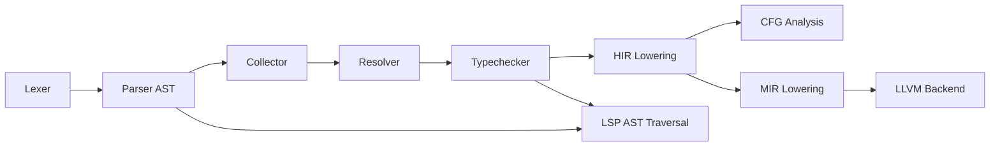
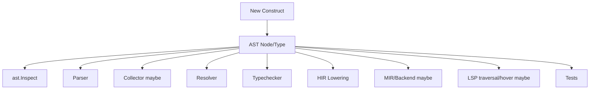
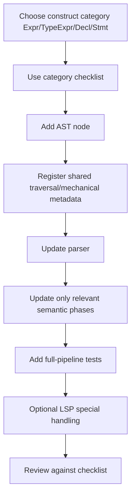

# Adding New AST / Type / Operator Support

## Goal

This note explains:

- current pain points when adding a new construct
- current compiler/LSP flow
- what must be updated today for cases like:
  - new data type
  - new expression/operator such as pipe
- proposal to reduce “many places to remember”
- proposed future flow

This is design/proposal only.

---

## 1. Problem

Current compiler architecture is phase-correct, but extension work is easy to miss in cross-cutting places.

Main pain:

- one new syntax node can require updates in many layers
- some of those are semantic phase updates
- some are mechanical traversal/registration updates
- forgetting one often causes:
  - silent missing behavior
  - partial support
  - hover/analysis drift
  - lowering/backend surprises later

Important distinction:

- **multiple semantic phases are good**
- **multiple manual cross-cutting lists are the real problem**

So goal should **not** be “merge phases”.

Goal should be:

- keep explicit compiler pipeline
- reduce manual touchpoints
- make forgotten updates fail loudly

---

## 2. Current Reality

Today, adding a new construct usually means touching both:

1. **semantic phase handlers**
2. **mechanical cross-cutting wiring**

### 2.1 Semantic phase handlers

These are legitimate places to update because each phase answers a different question:

- parser: syntax shape
- collector: top-level symbols/types
- resolver: names/scope
- typechecker: meaning/rules
- HIR lowering: canonical executable IR
- MIR/backend: runtime/codegen details

### 2.2 Mechanical cross-cutting wiring

These are where most “forgot to add it” bugs come from:

- AST inspection recursion
- LSP traversal
- hover node classification
- fingerprints / surfaces if relevant
- test helper coverage

---

## 3. Current Flow



This phase chain is correct and should stay explicit.

Problem is not this flow itself.

Problem is the number of manual extension points around it.

---

## 4. What You Must Update Today

This depends on what kind of construct you add.

## 4.1 If you add a new type form

Example:

- new type expression
- union/result/optional-like type
- new pointer/container type form

Likely touchpoints:

### AST

- `internal/frontend/ast`
- node/type struct
- location fields
- `internal/frontend/ast/inspect.go`

### Parser

- `internal/frontend/parser/parser.go`
- maybe expression parser too if type appears in casts/composites

### Collector

If top-level declarations or symbol shape change:

- `internal/semantics/collector/collector.go`

### Resolver

If type references contain names or nested paths:

- `internal/semantics/resolver/resolver.go`

### Typechecker

Always if type has real semantics:

- `internal/semantics/typechecker/typechecker.go`

### Lowering

If runtime representation matters:

- `internal/ir/hir_lower/lower.go`
- maybe `internal/ir/mir/model.go`
- maybe backend lowering

### LSP

If hover/type rendering should understand it specially:

- `internal/lsp/handlers.go`

### Tests

- parser tests
- typechecker tests
- pipeline tests
- maybe LSP hover tests

---

## 4.2 If you add a new expression/operator

Example:

- pipe operator
- new postfix/prefix/infix expression

Likely touchpoints:

### Lexer

If token is new:

- `internal/frontend/lexer`

### AST

- new expression node in `internal/frontend/ast`
- `inspect.go`

### Parser

- `internal/frontend/parser/parse_expr.go`
- precedence
- associativity
- recovery

### Resolver

If name binding/desugaring changes:

- `internal/semantics/resolver/resolver.go`

### Typechecker

- `internal/semantics/typechecker/typechecker.go`

### HIR lowering

- `internal/ir/hir_lower/lower.go`

### MIR / backend

Only if HIR cannot normalize/desugar it away

### LSP

- hover expression typing normally comes from `ExprTypes`
- custom rendering only if needed

### Tests

- parser
- typechecker
- pipeline
- maybe hover

---

## 4.3 If you add a new declaration kind

Example:

- `trait`
- `module`
- new top-level declaration kind

Likely touchpoints:

- AST struct
- parser top-level declaration parsing
- `ast.Inspect`
- collector
- resolver
- typechecker
- maybe pipeline/lowering if executable semantics exist
- LSP declaration hover logic
- tests

---

## 5. Why Forgetting Happens

Current “new construct” rollout looks like this:



The risky part is not `Resolver` or `Typechecker` existing.

The risky part is:

- `Inspect` is manual
- phase switches are manual
- LSP special handling is manual
- there is no single “extension checklist” encoded in repo structure

So forgetting is mostly a **coordination problem**.

---

## 6. Proposal

Keep explicit phases.

Reduce manual cross-cutting extension points.

## 6.1 Proposal A: Formalize construct categories

Treat new constructs as one of:

- `Expr`
- `TypeExpr`
- `Decl`
- `Stmt`

For each category, create a stable checklist document and/or local template.

Example:

### New `Expr` checklist

Must check:

1. lexer token if needed
2. AST node
3. `ast.Inspect`
4. parser precedence/recovery
5. resolver
6. typechecker
7. HIR lowering
8. tests
9. LSP if special behavior exists

### New `TypeExpr` checklist

Must check:

1. AST node
2. `ast.Inspect`
3. parser type parsing
4. resolver/type lookup
5. typechecker rules
6. lowering/runtime layout if needed
7. tests

This does not reduce phases, but it reduces uncertainty.

---

## 6.2 Proposal B: Centralize traversal harder

Current repo already improved this in LSP with:

- shared `walkModuleAST`

Similar direction should continue:

- one canonical AST traversal policy
- fewer hand-maintained recursive walks outside `ast.Inspect`

Long-term best improvement:

- reduce direct ad hoc tree walking
- push consumers through shared traversal helpers

This reduces “forgot to descend into child node X”.

---

## 6.3 Proposal C: Make omission fail loudly

Silent omission is worst outcome.

Preferred behavior:

- exhaustive switches where practical
- explicit panic on impossible internal unhandled node kinds in lowering/backends
- tests that assert newly introduced constructs survive full pipeline

If new node is not handled:

- fail immediately
- not silently degrade to nil or unknown

---

## 6.4 Proposal D: Introduce phase-facing extension tables only where mechanical

Good use of central tables:

- node category registration
- hover/declaration classification
- mechanical child traversal metadata

Bad use:

- collapsing resolver/typechecker/lowering into one mega “node handler registry”

Reason:

- that would remove phase clarity
- semantics differ by phase
- it becomes one hidden second architecture

So centralize **mechanical metadata**, not **semantic meaning**.

---

## 6.5 Proposal E: Add “full pipeline construct tests”

For every new construct, add at least:

1. parser test
2. semantic test
3. pipeline/lowering test

Optional:

4. LSP hover test

This ensures construct is not “parsed only”.

---

## 7. Proposed Future Flow

Proposed extension workflow:



This is better because:

- semantic phases stay explicit
- extension work starts from category checklist
- mechanical wiring becomes more centralized
- omissions become easier to spot

---

## 8. Concrete Example: Pipe Operator

Suppose we add:

```peep
value |> f()
```

Best shape:

### Parser

- parse as dedicated `PipeExpr`
- define precedence and associativity clearly

### Typechecker

- either typecheck as native operator rule
- or desugar mentally to call form during checking

### HIR lowering

Prefer normalize here:

- lower `PipeExpr(lhs, rhs)` into normal call-shaped HIR

If HIR is normalized, then:

- MIR does not need dedicated pipe concept
- backend does not need pipe concept

That is good reduction of downstream touchpoints.

So principle is:

- **keep syntax distinct in parser/AST**
- **normalize early in lowering if semantic shape matches existing construct**

That is real source-of-truth reduction.

---

## 9. Concrete Example: New Data Type

Suppose we add:

```peep
type Maybe = union {
  Some(i32),
  None,
}
```

This likely cannot be normalized away cheaply.

So updates would naturally span more phases:

- parser must know syntax
- resolver must know referenced names
- typechecker must know compatibility/matching rules
- lowering must know runtime representation
- backend may need layout/codegen changes

That is not duplication.

That is legitimate multi-phase meaning.

So for types, best improvement is not “merge logic”.

Best improvement is:

- checklist
- shared traversal
- exhaustive handling
- tighter tests

---

## 10. Recommended Direction

I would recommend:

1. Keep explicit phase chain exactly as architecture intends.
2. Add repo-level extension checklists for `Expr`, `TypeExpr`, `Decl`, `Stmt`.
3. Centralize more mechanical traversal/metadata.
4. Normalize syntax sugar early in HIR lowering where possible.
5. Make unhandled-node omissions fail loudly.
6. Add full-pipeline tests for every new construct.

---

## 11. Bottom Line

Your concern is valid.

But root issue is not “too many phases”.

Root issue is:

- too many **manual cross-cutting lists**
- not enough **structured rollout checklist**

So best solution is:

- fewer manual mechanical touchpoints
- not fewer semantic phases

That gives:

- less chance to forget updates
- cleaner compiler architecture
- no shortcut collapse of parser/resolver/typechecker/lowering responsibilities
